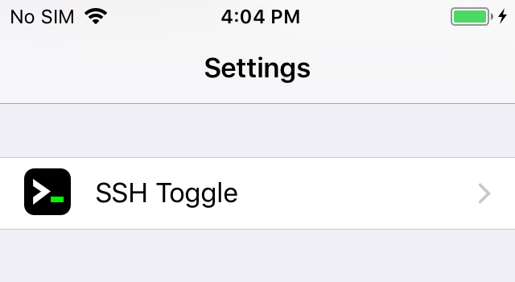
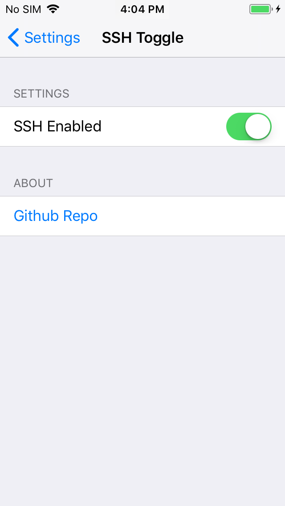

<div align="center">
    
    <h1>sshtoggle</h1>
    <h4>A MobileSubstrate tweak to start/stop SSH daemon</h4>
</div>


### Cydia Dependencies
1. PreferenceLoader
2. Sudo

### Pre-requisites
- Edit `/etc/sudoers` to include:

    ```conf
    mobile ALL=(ALL) NOPASSWD:/bin/launchctl
    ```

### Install

Get the latest version from [releases](https://github.com/Praseetha-KR/sshtoggle/releases)

```bash
$ ssh root@<device_ip>

curl -sSL https://github.com/Praseetha-KR/sshtoggle/releases/download/0.0.1/in.imagineer.sshtoggle_0.0.1_iphoneos-arm.deb?raw=true -O

dpkg -i in.imagineer.sshtoggle_0.0.1_iphoneos-arm.deb\?raw\=true

killall -9 backboardd
```

Now SSH Toggle settings will appear in iOS Settings. You can turn OFF/ON the SSH service.

| Settings  | SSH toggle |
|-----------|------------|
|  |  |

---

### Development Setup:

#### Tools:
- [theos](https://github.com/theos/theos/wiki/Installation)

#### build:

```
THEOS_DEVICE_IP=<ip> make package install
```
